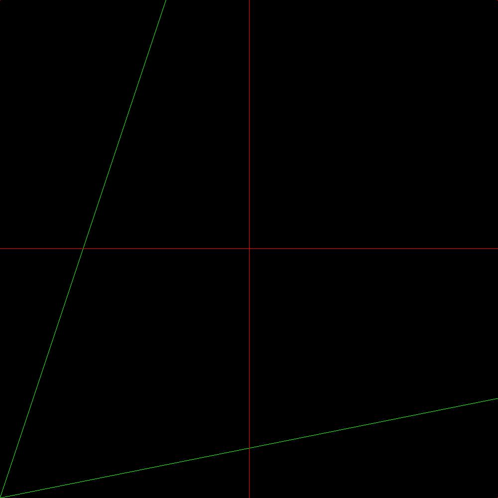
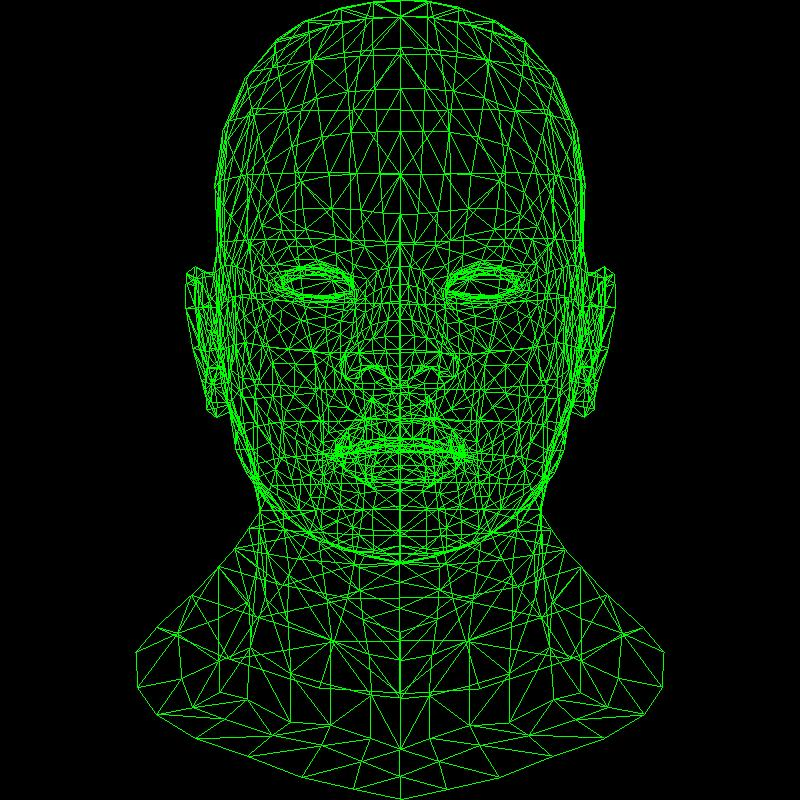
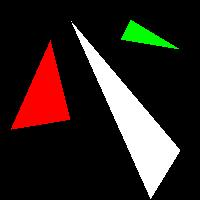

# my software renderer for learning about cg

## draws lines

## draws wireframes

## rasterizes triangles

## my learning material
[tiny renderer](https://github.com/ssloy/tinyrenderer)
[scratchapixel intro to gc](https://www.scratchapixel.com)
[olive.c](https://github.com/tsoding/olive.c)
[tsoding stream creating olivec](https://youtube.com/playlist?list=PLpM-Dvs8t0Va-Gb0Dp4d9t8yvNFHaKH6N)
